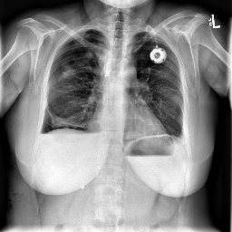
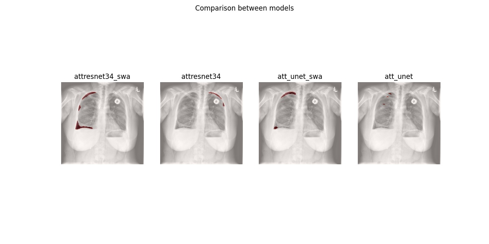

# Pneumothorax-Segmentation

### ABSTRACT
Pneumothorax is a medical condition in which there is an air leak between the chest wall and lungs. It is diagnosed by radiologists and it’s confirmation is a tedious task. Semantic image segmentation carried out using the Attention UNet and the Attention UNet + ResNet34 models, is used to detect pneumothorax in the radiological images, hence providing non-radiologists with confident results. Additionally, the difference in performance with conventional ways of training the models is analyzed and compared with contemporary methodologies used like snapshot callbacks and stochastic weighting average. The motivation for our approach is that the incorporation of the modish approach provides an upper hand when the model learns thereby enabling it to achieve greater performances than conventional approach and can provide an early diagnosis of pneumothoraces.
 

### REQUIREMENTS
The dataset was obtained from [SIIM-ACR Pneumothorax Segmentation](https://www.kaggle.com/c/siim-acr-pneumothorax-segmentation) competition.
The masks, train set and test set were unzipped (https://www.kaggle.com/iafoss/data-repack-and-image-statistics) and used as input.
These zip files were ultimately split into respective training and validation sets. Refer this file `src/resources/input/extraction.py`.

Other package requirements are as follows:

Module | Version
------ | -------
pandas | 0.25.3
numpy | 1.18.2
scikit-learn | 0.22.2.post1
opencv | 4.2.0
tensorflow | 2.1.0
keras | 2.3.1
 

### TEST IMAGE
This is one of the test images used for prediction.

 

### PREDICTION
The following image is an overlap of the masks produced by different models and the test image.

 

### SCORES OBTAINED
The scores obtained from the submission are tabulated as follows:

Model | Private Score | Public Score
----- | ------------- | ------------
Attention UNet | 0.7729 | 0.6498
Attention UNet + ResNet34 | 0.8006 | 0.8766
Attention UNet (with snapshot callbacks & SWA) | 0.733 | 0.8789
Attention UNet + ResNet34 (with snapshot callbacks & SWA) | 0.8222 | 0.9082
 

_This is an implementation of the paper **PNEUMOTHORAX SEGMENTATION** presented at [INOCON 2020](http://inoconf.org/)._
